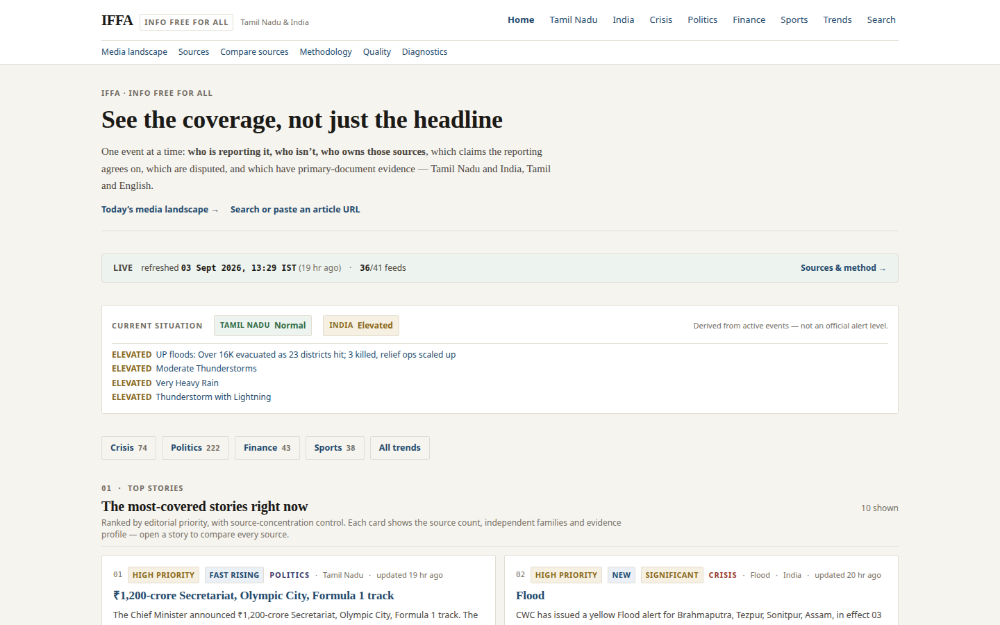
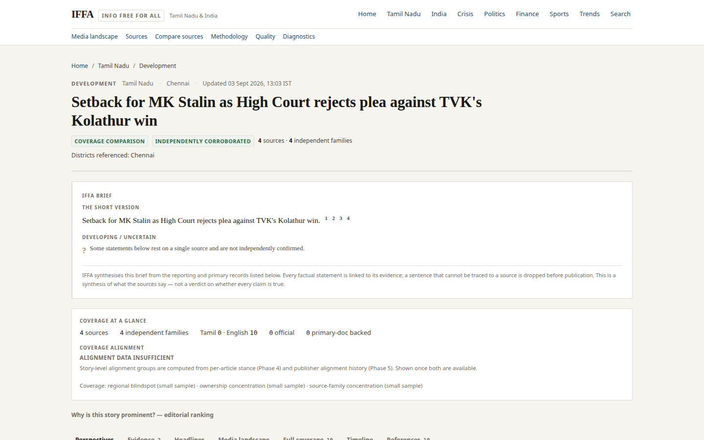
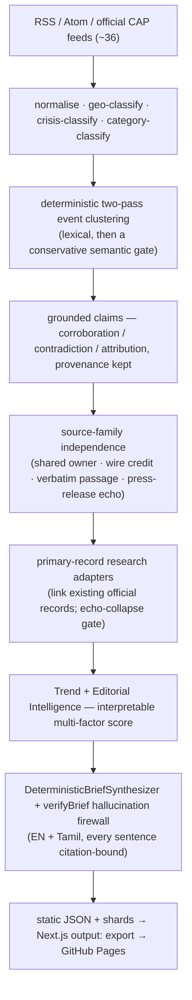

# IFFA — Info Free For All

**Tamil Nadu-first, India-aware evidence and current-event intelligence.**
One event. What happened. What changed. What is independently supported. What is
still a claim. Who reported it. Where coverage differs.

**Live:** https://rishidar-lab.github.io/info-for-all
**Release:** v0.12 — Productization Release Candidate · [release notes](docs/releases/v0.12-productization.md)
*(formerly "Info For All / IFA"; the repository and URL are unchanged.)*

<p>
  
  
</p>

---

## Why it exists

Most news aggregation answers *"what is being said"*. IFFA is built to answer the
questions underneath it:

- **Who is actually reporting this** — and who isn't? Ten sites running one wire
  dispatch are *one* confirmation, not ten.
- **What do the reports agree on**, what is disputed, and what rests on a single
  source?
- **Is there a primary record** — an official order, a court judgment, an IMD
  alert — behind the claim?
- **How does the framing differ** between Tamil and English, local and national,
  government and independent coverage?

IFFA's edge is meant to be *epistemic honesty*, not algorithmic confidence. When
the evidence isn't there, it says so — a withheld brief is a correct outcome,
not a failure.

## What IFFA does not do

- No **truth score**, **bias percentage**, **reliability score**, or
  Left/Center/Right label. Stance and framing classifiers exist but are not
  calibrated well enough for a user-facing number (see [Evaluation](#evaluation)),
  so they are shown as *observed coverage / framing*, gated by sample size, and
  never as pseudo-precise ratings.
- No language model in the deployed build. No database. No paid infrastructure.
- No full article text — only headlines, timestamps, short feed excerpts,
  structured alert metadata, and derived claims. It never bypasses paywalls or
  access controls.

## Scope

| Tier | Coverage |
|---|---|
| **P0** | Tamil Nadu — all 38 districts, in English and Tamil script |
| **P1** | India — national |
| **P2** | Abroad, only when it materially affects Tamil Nadu / India / Indian citizens / the economy / markets / foreign policy, or is a major global crisis |

**Category priority:** Crisis → Politics → Finance → Sports. Entertainment and
celebrity are classified and kept searchable, but excluded from the default feed.

## How it works



Nothing in that pipeline requires a credential. The site is 962 fully
pre-rendered static pages; the only client-side data fetch is a compact index
shard for "load more" and search.

### Key subsystems

| Subsystem | Where | What it guarantees |
|---|---|---|
| Event identity | [`src/lib/event-identity/`](src/lib/event-identity) · [docs](docs/EVENT-IDENTITY.md) | Two reports merge only when time window, geography, event type and either headline overlap or a structured semantic signature all agree. When unsure, keep apart. Tamil ↔ English never merges on a shared "Tamil Nadu" alone. |
| Claims & provenance | [`src/lib/claims/`](src/lib/claims) · [docs](docs/CLAIM-CONFIDENCE.md) | Every claim carries a status (corroborated / single-source / attributed / disputed / outdated) and its provenance. "Corroborated" = ≥ 2 independent source families, never a majority vote. An allegation stays the speaker's claim. |
| Source independence | [`src/lib/independence/`](src/lib/independence) + [`src/lib/research/independence.ts`](src/lib/research/independence.ts) | Collapses sources to one family on shared corporate parent, shared wire credit, ≥ 85% 5-gram overlap, or a press-release echo. `genuineIndependentFamilies` gates the brief. |
| IFFA Brief | [`src/lib/brief/`](src/lib/brief) · [docs](docs/BRIEF-MODEL.md) | A native prose account built **only** from cited reporting and primary records. `verifyBrief` drops any sentence whose claims, numbers, dates, entities or attribution can't be traced to a source; if nothing survives, the brief is withheld. |
| Media landscape | [`src/lib/media-landscape/`](src/lib/media-landscape) · [docs](docs/MEDIA-LANDSCAPE.md) | Provenance-backed ownership registry (36 publishers), coverage landscape, headline/framing comparison, blindspot engine, claim-evidence matrix — all off the frozen claim engine, all sample-size gated. |
| Research adapters | [`src/lib/research/`](src/lib/research) · [docs](docs/RESEARCH-MODEL.md) | Links a withheld story to an existing official record (RBI, SACHET) where the claim domain matches, behind an echo-collapse gate so a press release can't masquerade as independent confirmation. |
| Trend / editorial ranking | [`src/lib/trends/`](src/lib/trends) · [docs](docs/TREND-MODEL.md), [docs](docs/EDITORIAL-MODEL.md) | `score = 100 · Π (subScore_i ^ w_i)` over eight visible factors. A ranking, not a probability of truth. Every sub-score is shown. |

## Routes

`/` · `/tamil-nadu` `/india` · `/crisis` `/politics` `/finance` `/sports` ·
`/trends` · `/search` · `/story/[slug]` (brief, evidence, coverage comparison,
timeline, references) · `/landscape` `/tamil-nadu/landscape` · `/sources`
`/source/[id]` `/source/compare` · `/about` (methodology) ·
`/methodology/quality` (evaluation dashboard) · `/methodology/examples` ·
`/diagnostics`.

## Evaluation

Run against hand-labelled corpora. Reported honestly — the weak numbers are not
hidden.

| Corpus | Metric | Result |
|---|---|---|
| Claim quality (223 cases) | fully-clean | **99.6%** (222/223) |
| False corroboration (71 cases) | rate | **0%** |
| Category classifier (175 headlines) | accuracy | **100%**; secondary-set recall 80.8% |
| Event identity (223 cases) | candidate recall / decision precision | **99.1% / 100%** (decision recall 86%) |
| Claim-evidence status (36 cases, *not human-verified*) | accuracy | 94% — indicative only |
| Stance (64 cases, *not human-verified*) | accuracy | **54.7%** — indicative only, **not fit for a user-facing rating** |
| Headline framing (30 cases, *not human-verified*) | precision / recall | **75% / 41%** — indicative only, weak |

Evidence-status classification is materially stronger than stance / framing.
That asymmetry is why IFFA shows *observed* coverage and framing, gated by
sample size, and never a bias percentage.

```
npm run eval:claims      npm run eval:identity     npm run eval:category
npm run eval:evidence     npm run eval:stance       npm run eval:framing
npm run quality-gate      # release gates (11/11)
```

## Develop

```
npm install
npm run dev            # local dev on the committed demo snapshot
npm run ingest         # fetch feeds → src/data/generated/live-feed.json (gitignored)
npm run build          # 962 static pages → out/
npm run verify         # lint + typecheck + test + build
npm run test:e2e       # Playwright — desktop + mobile-390
```

- **478 unit tests** (`npm test`), **84 E2E tests** (`npm run test:e2e`).
- Data hygiene: the live snapshot is gitignored and seeded from a committed
  fixture — [docs/DATA-HYGIENE.md](docs/DATA-HYGIENE.md).
- Deployment: GitHub Actions rebuilds and redeploys on push and on a schedule
  ([.github/workflows/](.github/workflows)).

## Privacy

IFFA runs **no analytics by default** and sets no tracking cookies. A typed,
provider-agnostic analytics abstraction exists ([docs/PRODUCT-METRICS.md](docs/PRODUCT-METRICS.md))
so a privacy-respecting provider *can* be connected later via an adapter — the
app behaves identically with it disabled, and it never records article text or
sensitive search terms.

## Limitations

- Clustering, geo / category classification and claim extraction are rule-based
  and can err. The linked publisher is always authoritative.
- Stance and framing classifiers are not calibrated (see above).
- The corpus is ~36 feeds / 36 publishers; a story with one newsroom often has
  no independent second source *in IFFA*, even when wider coverage exists.
  Widening that is the [Coverage Discovery](docs/ROADMAP.md) track.
- Novelty compares snapshots and can miss a fact expressed only in prose.
- **IFFA is not an emergency service.** For any emergency, follow the issuing
  authority's own instructions.

## Not v1.0

v1.0 needs the evidence gates, cross-language clustering, coverage discovery,
mobile UX and production monitoring all verified in *live* operation over time,
and a calibrated (or removed) stance model. See
[docs/releases/v0.12-productization.md](docs/releases/v0.12-productization.md)
for the remaining v1.0 criteria and [docs/ROADMAP.md](docs/ROADMAP.md).

## More

[Engineering case study](docs/CASE-STUDY.md) ·
[Architecture](docs/ARCHITECTURE.md) ·
[Methodology](docs/METHODOLOGY.md) ·
[Product metrics](docs/PRODUCT-METRICS.md) ·
[Commercial readiness](docs/COMMERCIAL-READINESS.md) ·
[Roadmap](docs/ROADMAP.md) ·
[Release archive](docs/releases/archive/)

## License & contact

License is unspecified pending an explicit decision by the repository owner —
treat as "all rights reserved" until then. Issues, questions and project
contact: **https://github.com/Rishidar-lab/info-for-all**.
