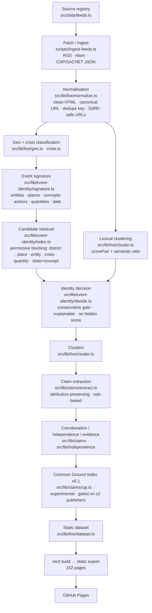
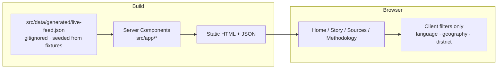

# IFFA Architecture

**Status:** current as of **v0.8 — Live Signal Intelligence**. This document
describes what the repository actually builds and deploys today. An earlier
revision described a Drizzle / SQLite / Next.js-API-route service that was
**abandoned** before launch — see [Superseded design](#superseded-design).

> **v0.8 additions (all additive — the v0.6 claim / identity engine is
> byte-unchanged; `cluster.ts` gains a split-ONLY specialist guard):**
> - `src/lib/domain/classify.ts` — multi-signal category classifier
>   (`classifyEvent`): headline + excerpt + Tamil gloss + signature
>   entities/concepts/actions + finance instruments + sports competitions + a
>   "government actor + governance action" pattern + casualty-count detection.
>   Returns primary + secondary + confidence CLASS + matched signals. Wired into
>   `enrich.ts` over ALL cluster member headlines.
> - `src/lib/domain/severity.ts` — event severity (informational → critical),
>   separate from provenance.
> - `src/lib/trends/novelty.ts` — claim-aware novelty v2 (`assessNovelty`,
>   `buildEventState`): compares factual units between snapshots.
> - `src/lib/live/cluster.ts::specialistVeto` — sports-fixture / finance-move
>   split guard, applied after the frozen engine says "same" (never merges).
> - `src/data/feeds.ts` — +8 live finance/sports feeds, `ownershipGroup`,
>   5-state source health in `scripts/ingest-feeds.ts` (`FeedStatus.health`,
>   `httpState`, `itemsSeen/Accepted/Rejected`, `lastItemAt`, `medianLagMinutes`).
> - `evaluation/category/` + `scripts/eval-category.ts` — 114-case gold corpus,
>   per-category P/R/F1, confusion matrix, release gate.
> - `playwright.config.ts` + `tests/e2e/` — real browser E2E (desktop + 390px).
> - `public/sw.js` + `src/components/iffa/pwa.tsx` — offline shell.

> **v0.7 additions (all additive — the v0.6 identity / claim / clustering engine
> is untouched, and its corpus numbers hold identical):**
> - `src/lib/domain/` — deterministic classifiers: `categories.ts` (news domain:
>   crisis / politics / finance / sports; entertainment & celebrity disabled by
>   default), `geo-tiers.ts` (P0 Tamil Nadu / P1 India / P2 abroad-relevant /
>   out), `districts.ts` (Tamil-script names + resolver for all 38 districts),
>   `finance.ts` / `sports.ts` (number-unit and fixture safety guards).
> - `src/lib/trends/` — a **pure** enrichment layer run in `ingest-feeds.ts`
>   *after* clustering: velocity (by independent family), novelty vs the previous
>   snapshot, an interpretable `trendScore` (weighted geometric mean, weights in
>   `weights.ts`), the Current Situation bar, and event timelines. Consumes
>   `LiveArticle[]` / `LiveCluster[]`, writes `cluster.trendData` +
>   `dataset.trending` / `watching` / `situation` / `counts.byCategory`.
> - `src/data/feeds.ts` — typed source-registry metadata (`describeFeed()`).
> - UI: event-first `/` + `/crisis` `/politics` `/finance` `/sports` `/tamil-nadu`
>   `/india` `/trends` `/diagnostics`; `components/iffa/`.
> - See `docs/TREND-MODEL.md`.

## What IFA is, structurally

A **fully static Next.js 16 site**. No database, no API routes, no server at
runtime. Everything is computed at build time from a committed data snapshot and
emitted as static HTML + JSON for GitHub Pages.

- `next.config.ts`: `output: "export"`, `trailingSlash: true`, `basePath` from
  `PAGES_BASE_PATH`.
- Deploy: `.github/workflows/deploy-pages.yml` (push, 15-min schedule, manual
  dispatch) runs the ingest + build and publishes `out/`.
- The deterministic, rule-based pipeline runs in `scripts/` and `src/lib/`. **No
  LLM / paid API is called in the deployed build.** `@anthropic-ai/sdk` /
  `openai` are optional, dormant dependencies gated behind `IFA_*_PROVIDER` env
  vars that are never set in CI.

## Pipeline

## Render flow

Pages are all `○ (Static)` or `● (SSG)`. `generateStaticParams` enumerates every
cluster (`/story/[slug]`, `/methodology/clusters/[slug]`) and worked example
(`/methodology/examples/[slug]`).

## Module boundaries

| Module | Responsibility |
| ------ | -------------- |
| `src/data/feeds.ts` | the source registry — publisher, URL, kind, language, evidence role. No URL is invented. |
| `src/lib/live/parse.ts` | RSS / Atom / CAP(SACHET JSON) → `RawItem` via `fast-xml-parser` |
| `src/lib/live/normalize.ts` | `RawItem` → `LiveArticle`: HTML strip, entity decode, canonical + SSRF-safe URL, dedupe key, language detect |
| `src/lib/live/geo.ts` · `crisis.ts` | explainable TN geo-classification; deterministic 0–100 crisis priority; CAP severity/urgency/certainty preserved verbatim |
| `src/lib/event-identity/*` | "are these two articles the same event?" — `buildSignature`, `candidatePairs` (permissive), `decideIdentity` (conservative, explainable) |
| `src/lib/semantic/*` | `concepts.ts` (EN→concept lexicon), `actions.ts` (action ontology), `embeddings.ts` (deterministic hashing embedding, retrieval-only) |
| `src/lib/language/*` | `tamil.ts` (conservative news-domain normaliser + concept/place/org lexicon), `locations.ts` (canonical place registry + `placeRelation`), `translation.ts` (offline dictionary gloss) |
| `src/lib/live/cluster.ts` | two-pass clustering: lexical `scorePair`, then a semantic pass that only ADDS merges; "semantic veto" lets the identity engine's location model overrule a lexical match |
| `src/lib/claims/*` | rule-based claim extraction with mandatory attribution retention; `normalize`, `corroborate` (union-find; syndicated copies collapse to one group), `contradict` (genuine numeric/temporal conflicts only), `evidence`, `confidence`, `cgi` (experimental), `present` |
| `src/lib/independence/*` | pair-classified independence (independent / likely / syndicated / likely-syndicated / **unknown**) + wire-service detection |
| `src/lib/live/dataset.ts` | assembles the final view model the pages read |
| `src/app/*` | Next.js RSC pages — read the dataset, render, no data fetching |

Every heavy step is a plain function over plain data, unit-tested in isolation
(`tests/unit/`, Vitest). The evaluation harness (`evaluation/claims/`) runs the
**real** pipeline against a hand-labelled gold corpus.

## Data

- **Snapshot:** `src/data/generated/live-feed.json` (gitignored). In CI it is
  produced by `scripts/ingest-feeds.ts`; locally it is seeded from
  `src/data/fixtures/live-feed.seed.json` by `scripts/prepare-data.ts` (an npm
  `pre*` hook), so `npm test` / `npm run build` work with no network.
- **No persistent store.** Each build is a pure function of the snapshot. There
  are no migrations, no ORM, no timestamps-as-rows.
- **Hygiene:** running `npm run ingest` / the eval scripts refreshes committed
  report artifacts under `evaluation/reports/` and `src/data/claim-eval.json`
  (timestamps + minor runtime jitter). Those are release artifacts, not tree
  dirt. `next dev` re-adds the agent block to `AGENTS.md`.

## Safety properties enforced in code + CI

- **No fabricated consensus.** The identity gate that emits `relation: "same"` is
  deliberately strict; permissiveness lives only in candidate generation.
  `npm run quality-gate` fails the build if the live snapshot shows any
  fabricated corroboration.
- **Attribution is never dropped.** "the minister said X" extracts as an
  attributed claim, never a bare fact.
- **Cross-language merges require structured agreement** — a shared district or
  specific place, a compatible date, and a shared entity/action or ≥2 shared
  specific concepts. A shared "Tamil Nadu" alone never merges. Confidence is
  capped at Moderate.
- **Tamil original text is always preserved** alongside any normalised form.
- **SSRF:** feed URLs are validated to `http(s)` only; localhost / RFC1918 /
  link-local / metadata addresses are rejected at ingest.
- **No political-orientation labels** on live content. Left/Center/Right appear
  only in the static worked examples at `/methodology/examples`.

## Possible future architecture (NOT built)

These are designed-for, not present. Adopting any of them is an explicit
decision, not implied by this document.

- Streaming / realtime ingestion and live event pages.
- A persistent store (only if incremental state across builds is actually
  needed — the static model is intentional until then).
- A model-assisted extraction / translation provider behind the existing
  `IFA_CLAIM_PROVIDER` / `IFA_TRANSLATION_PROVIDER` / `IFA_EMBEDDING_PROVIDER`
  seams.
- Source-ownership graph, personalisation, a public API, a mobile client.

See `docs/ROADMAP.md` for the phased view.

## Superseded design

An earlier revision of this file (and `docs/ROADMAP.md` Phase 0) described:

> Drizzle schema (16 core models), SQLite via `better-sqlite3` with a
> PostgreSQL/`pgvector` upgrade path, Next.js `/api` route handlers with Zod
> validation, `src/lib/{domain,ingestion,intelligence,clustering,cgi}`, a
> `docker/Dockerfile` + `docker-compose.yml`, `GET /api/health`.

That service was built as an MVP and then **abandoned**: its uncommitted pglite
DB layer failed during `next build`, and the project was refocused onto the
comparison UI as a fully static site. The code was removed (recoverable at commit
`e99ae64`). `package.json` still lists `@electric-sql/pglite`, `postgres`,
`drizzle-orm`, `drizzle-kit` — retained only to avoid a risky `npm install` in
the constrained build environment; nothing imports them (see
`evaluation/reports/v0.6-dependency-audit.md`).
