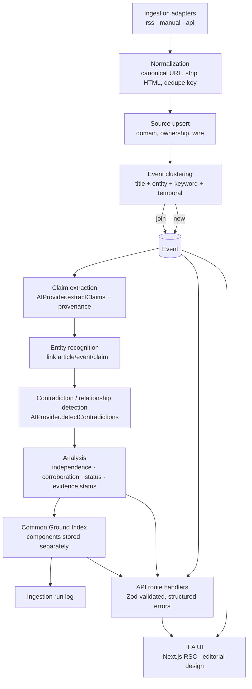

# IFA Architecture

## Pipeline



## Request / render flow

```mermaid
flowchart LR
    subgraph Browser
      P[Page / Story / Search]
    end
    subgraph Next.js server
      RSC[Server Components] --> DOM[domain layer<br/>src/lib/domain/*]
      RH[Route handlers<br/>src/app/api/*] --> DOM
      DOM --> DB[(SQLite via Drizzle)]
      DOM --> INT[AIProvider<br/>mock | anthropic | openai]
    end
    P -->|HTML| RSC
    P -->|fetch JSON| RH
```

## Module boundaries

| Module | Responsibility | Key interface |
| ------ | -------------- | ------------- |
| `src/lib/ingestion/*` | native payload → `RawFeedItem` → `NormalizedArticle`; SSRF guard | `IngestionAdapter<TInput>` |
| `src/lib/clustering` | assign an article to an event or start a new one | `ClusteringService` |
| `src/lib/intelligence` | claim extraction, summarisation, contradiction detection, embeddings | `AIProvider` |
| `src/lib/independence` | collapse non-independent articles into clusters | `computeIndependence()` |
| `src/lib/cgi` | transparent, component-based Common Ground Index | `computeCgi()`, versioned `CGI_WEIGHTS_*` |
| `src/lib/search` | cross-entity ranked search over a caller-supplied corpus | `SearchService` |
| `src/lib/domain/*` | orchestration + DB queries + serialised view models | `analyzeEvent`, `ingest`, `getEventDetail`, `runSearch` |
| `src/app/*` | Next.js pages (RSC) and `/api` route handlers | — |

Every heavy module is an interface with a v1 implementation, so it can be replaced without touching
callers. Domain orchestration functions take a `Db` argument (dependency injection) so tests run
against isolated databases.

## Data model

16 core models plus supporting tables. `SOURCE → ARTICLE → CLAIM → EVIDENCE` is the provenance chain;
`ClaimRelationship` (`SUPPORTS` / `CONTRADICTS` / `REFINES` / `DUPLICATES`) is the claim graph.

```mermaid
erDiagram
    SOURCE ||--o{ ARTICLE : publishes
    EVENT ||--o{ EVENT_ARTICLE : clusters
    ARTICLE ||--o{ EVENT_ARTICLE : in
    EVENT ||--o{ CLAIM : has
    ARTICLE ||--o{ CLAIM : "extracted from"
    CLAIM ||--o{ CLAIM_EVIDENCE : cites
    EVIDENCE ||--o{ CLAIM_EVIDENCE : supports
    CLAIM ||--o{ CLAIM_RELATIONSHIP : from
    CLAIM ||--o{ CLAIM_RELATIONSHIP : to
    EVENT ||--o{ TIMELINE_ENTRY : records
    EVENT ||--o{ COMMON_GROUND_SCORE : scored
    COMMON_GROUND_SCORE ||--o{ CGI_COMPONENT : "broken down into"
    EVENT ||--o{ EVENT_TOPIC : tagged
    TOPIC ||--o{ EVENT_TOPIC : tags
    EVENT ||--o{ CORRECTION : "corrected by"
    ENTITY ||--o{ ARTICLE_ENTITY : mentioned
    ENTITY ||--o{ EVENT_ENTITY : salient
    ENTITY ||--o{ CLAIM_ENTITY : referenced
```

Timestamps are epoch-ms integers surfacing as `Date`. `isDemo` marks synthetic rows. Scores keep an
`inputsSnapshot` and their component rows so the formula can evolve without losing history.

## Deviations from the master spec (and the upgrade path)

### SQLite → PostgreSQL (Phase 1)

The schema avoids SQLite-only constructs. To move to Postgres:

1. add a `postgres` Drizzle dialect schema (same table/column names; `text` → `text`, timestamp
   columns → `timestamptz`, JSON columns → `jsonb`);
2. point `DATABASE_URL` at the `docker-compose.yml` Postgres service;
3. regenerate migrations for the new dialect;
4. no domain-layer changes — queries use the portable Drizzle query builder, no raw SQL.

### In-app search → Postgres FTS / pgvector (Phase 1–2)

`SearchService` is the seam. `InMemorySearch` (TF-IDF over a rebuilt corpus) is swapped for:

- **Phase 1:** a `PostgresFtsSearch` using `to_tsvector` / `ts_rank` and a materialised `search_documents` table;
- **Phase 2:** a `VectorSearch` using `pgvector` + `AIProvider.embed()` for semantic recall, with FTS as the lexical prefilter.

The API contract (`/api/search?q=&type=&limit=`) does not change.

### Prisma → Drizzle

`prisma` npm `latest` currently resolves to a release candidate. Drizzle is a mature TypeScript ORM
with no binary engine, no codegen, and plain-SQL migrations. Domain code depends only on the Drizzle
query builder and the `$inferSelect` / `$inferInsert` types.

## Deployment

- **Docker:** `docker/Dockerfile` (multi-stage; standalone Next output; `better-sqlite3` rebuilt in
  the runner). `docker-compose.yml` runs the app with a volume-mounted SQLite file and an optional
  Postgres service for the Phase 1 path.
- **Node:** `npm run build && npm run db:setup && npm start`.
- Route handlers and DB-reading pages are `force-dynamic`; `better-sqlite3` is in
  `serverExternalPackages` so Turbopack never bundles it.

## Observability

`src/lib/logger.ts` — dependency-free structured JSON with recursive secret redaction. The `route()`
wrapper logs `request.completed` / `request.failed` with status, duration, error code and request id.
`GET /api/health` returns database status, event count, demo-mode flag, active AI provider, version
and timestamp.
